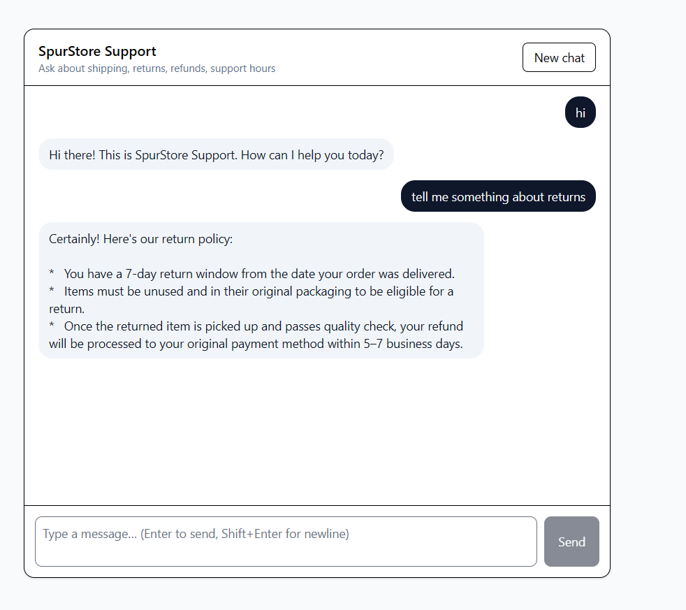

# Spur – AI Live Chat Agent

Minimal AI-powered live chat support widget built with Bun, TypeScript,
PostgreSQL, Drizzle, SvelteKit, Tailwind, and Gemini API.

## Features
- Chat UI with user & AI messages
- Persistent conversations in PostgreSQL
- Gemini-powered AI support replies

## Setup

### Backend
cd api
cp .env.local .env

## update DATABASE_URL and GEMINI_API_KEY in .env

bun install
bunx drizzle-kit generate --dialect postgresql --schema ./src/db/schema.ts --out ./drizzle
bun run src/db/migrate.ts
bun run src/index.ts

### Frontend
cd client
cp .env.local .env
bun install
bun dev

